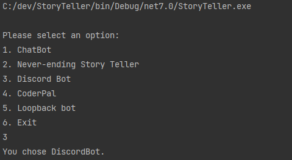

# C# cli and discord boot for LLM inference

currently supports gguf models 

# Summary of `InferenceParams` Class Fields

## General Parameters

### TokensKeep
- **Description**: Specifies how many tokens from the initial prompt should be retained.
- **Default**: `0`

### MaxTokens
- **Description**: Maximum number of new tokens to predict.
- **Default**: `-1` (infinite until completion)

### LogitBias
- **Description**: A dictionary mapping specific tokens to their logit biases.
- **Default**: `null`

### AntiPrompts
- **Description**: Sequences where generation stops.
- **Default**: Empty array

### PathSession
- **Description**: File path for saving/loading model eval state.
- **Default**: Empty string

## Input Formatting

### InputSuffix
- **Description**: Suffix to add to user inputs.
- **Default**: Empty string

### InputPrefix
- **Description**: Prefix to add to user inputs.
- **Default**: Empty string

## Token Selection

### TopK
- **Description**: Number of most probable tokens to consider for generation.
- **Default**: `40`

### TopP
- **Description**: Cumulative probability mass threshold.
- **Default**: `0.95`

### TfsZ
- **Description**: Unknown (Documentation missing).
- **Default**: `1.0`

### TypicalP
- **Description**: Unknown (Documentation missing).
- **Default**: `1.0`

### Temperature
- **Description**: Controls randomness in token selection.
- **Default**: `0.8`

## Penalties

### RepeatPenalty
- **Description**: Penalty for token repetition.
- **Default**: `1.1`

### RepeatLastTokensCount
- **Description**: Last n tokens to penalize.
- **Default**: `64`

### FrequencyPenalty
- **Description**: Coefficient for frequency penalty.
- **Default**: `0.0`

### PresencePenalty
- **Description**: Coefficient for presence penalty.
- **Default**: `0.0`

## Mirostat Parameters

### Mirostat
- **Description**: Algorithm type based on the paper [https://arxiv.org/abs/2007.14966](https://arxiv.org/abs/2007.14966).
- **Default**: `Disabled`

### MirostatTau
- **Description**: Target entropy for Mirostat.
- **Default**: `5.0`

### MirostatEta
- **Description**: Learning rate for Mirostat.
- **Default**: `0.1`

## Miscellaneous

### PenalizeNL
- **Description**: Consider newlines as repeatable tokens.
- **Default**: `true`
